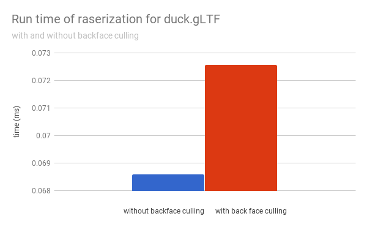

CUDA Rasterizer
===============

[CLICK ME FOR INSTRUCTION OF THIS PROJECT](./INSTRUCTION.md)

**University of Pennsylvania, CIS 565: GPU Programming and Architecture, Project 4**

* Yalun Hu
* Tested on: Windows 10, i7-6700HQ CPU @ 2.60GHz 32GB, GTX 1070 8192MB (Personal computer)

  

# Features

## 1. Basic Rasterizer
* Vertex shading
* Primitive assembly with support for triangles read from buffers of index and vertex data.
* Rasterization
* Fragment shading
    * A depth buffer for storing and depth testing fragments.
    * Fragment-to-depth-buffer writing (with atomics for race avoidance).
    * (Fragment shader) simple lighting scheme, such as Lambert or Blinn-Phong.

  

## 2. Support for rasterizing lines and points
* **Points**
Assemble primitives as points instead of triangles.

  

* **Lines**
Assemble primitives as lines instead of triangles.

  

  

## 3. Correct color interpolation between points on a primitive.
Use barycentric coordinates to interpolate colors in each triangle. See the top of the car.

  

## 4. UV texture mapping with bilinear texture filtering and perspective correct texture coordinates.
Read texture from glTF and use bilinear texture filtering in fragment shader to get texture. Also correctly interpolate Z in rasterization.

  

## 5. Non-Photorealistic Rendering (Toon Shading)
In fragment shader, add toon shading method. To implement toon shading, just discretize the lambert and specular term by some step size(here stepsize = 3), and use lerp to decide the fraction of toon effect in final color(here fraction = 0.7).

  

## 6. Backface culling
In rasterization part, ignore triangles that face the same direction as the camera-to-triangle ray.

# Performance Analysis
## Breakdown of time spent in each pipeline stage for a three different models

  

It shows that the rasterization takes the most part of time in car and duck model, but only small part in duck model. Because duck model has many faces(triangles) with smaller area, which means in each thread(each triangle), the number of fragments are less than other two models.

## Bakcface Culling

  

It shows that backface culling do improve performance for model with many backfaces.

# Credits

* [tinygltfloader](https://github.com/syoyo/tinygltfloader) by [@soyoyo](https://github.com/syoyo)
* [glTF Sample Models](https://github.com/KhronosGroup/glTF/blob/master/sampleModels/README.md)
